# 🌍 Climate Mesh

**Decentralised climate monitoring & AI-powered early-warning mesh — runs on a Raspberry Pi 5.**

**The problem.** Flood and heat warnings fail exactly where they matter: the
nearest official flood gauge can be kilometres from the stream that actually
overflows, so by the time a warning reaches a community, the water is already
rising. There is a gap between where climate events happen and where they are
measured.

**The solution.** Climate Mesh is a network of 20 environmental "nodes" across
Greater London. It scores each location's climate risk 0–100 in real
time, uses an explainable AI anomaly model plus *mesh correlation* (nearby
nodes confirming a trend) to escalate genuine events, and raises plain-English
alerts with community action playbooks — all on a single Raspberry Pi, offline,
with no cloud subscription.

**What is genuinely novel here.**

- **A canonical reading contract:** physical sensor, live API, and simulation
  all emit the *same* reading shape, so the system is **sensor-ready without
  being sensor-dependent** — a real node joins the mesh by adding one adapter,
  and nothing downstream changes.
- **Mesh agreement as a two-sided trust signal:** a 1.2× escalation fires
  only when **2+ adjacent nodes** agree for the same hazard, and a node that
  is elevated while *no* neighbour agrees is damped (0.75×) and reported as a
  **sensor-check**, not as the hazard — so a single glitching node cannot cry
  wolf. Both directions are tested (`tests/test_corroboration.py`).
- **Provenance-first honesty:** every reading, dashboard panel, alert, and
  export carries its data source (`hardware / api / demo / simulation`) and a
  quality flag — honesty is a designed-in feature, not a disclaimer.
- **One-command reproducibility:** judges can prove the whole system works
  from a clean clone with a single command.

**Measured results** *(from this repo's deterministic simulation/demo pipeline —
not field measurements; no physical sensor has been validated yet)*:

- **228/228 automated tests pass** on Python 3.11, 3.12 and 3.13, and on 64-bit Arm Linux in CI; `python scripts/judge_validate.py` → **PASS (5/5 steps)**.
- The demo tour (`python scripts/demo_tour.py`, a few seconds) discriminates
  correctly across scenarios: **normal stays SAFE** (avg risk 3.9, 0 alerts)
  while **flood escalates the right nodes** (Regent's Canal → CRITICAL
  100.0, 10 alerts), and heatwave/smog/storm each escalate their own hazard
  profile. Output is deterministic — repeated runs print identical numbers.
- Runs fully offline on any computer or a Raspberry Pi 5.

> **Honest by design — sensor-ready, not sensor-dependent.**
> Physical sensor support is hardware-ready but **not required** for the current
> demo. Until sensors are connected, Climate Mesh uses clearly-labelled
> **simulated** and/or **live API** data. Every reading shows its source
> (`simulation` / `demo` / `api` / `hardware`) so nothing is ever overstated.

Built by **Luis Yu and Leo Zhang**, two sixth-form students (years 12–13
category), for the PA Raspberry Pi Competition 2026/27 — theme *Building a
Positive Human Future* (Safer Societies & Sustainable World).

> **Submitting this project?** Everything a teacher needs — the written entry,
> entry-form answers and where the photos go — is in
> [`SUBMISSION_PACK/`](SUBMISSION_PACK/README_FOR_TEACHER.md).

---

## The dashboard

A 7-tab Streamlit dashboard reads the same SQLite database the engine writes:

- **Live Map** — the 20 nodes on a Greater London map, coloured and sized by
  risk score, each with a provenance badge on hover.
- **Network Overview** — average risk, highest-risk node, active alerts, and
  risk-by-node / risk-distribution charts.
- **Node Detail** — one node's readings, its six risk sub-scores, and a
  10-minute history.
- **AI Explainability** — which nodes the Isolation Forest flagged and why,
  plus the anomaly-score distribution.
- **Evidence & Validation** — run metadata, row counts, and the export commands.
- **Hardware Readiness** — live driver/device detection, with provenance
  derived from actual data, never from a library merely being importable.
- **Competition Pitch** — the summary pitch.

Every panel carries its data source and a quality flag, which is the point: in
demo mode the badges read *Digital Twin (Demo)*, so nothing is passed off as a
real measurement. See it yourself from a clean clone:

```bash
python run.py --mode demo --scenario flood --judge-mode   # terminal 1
python -m streamlit run dashboard/app.py                  # terminal 2, opens http://localhost:8501
```

## What works right now

- ✅ 20 named Greater London nodes on a live risk map (an illustrative layout
  of well-known public landmarks — see `config/nodes.py`; no node marks a
  deployed sensor).
- ✅ Five demo scenarios: **normal, flood, heatwave, smog, storm**.
- ✅ 0–100 risk scores with **SAFE / MODERATE / WARNING / CRITICAL** levels.
- ✅ Explainable AI (Isolation Forest) + **mesh correlation** across adjacent nodes.
- ✅ Plain-English alerts with **community action playbooks**.
- ✅ A 7-tab Streamlit dashboard with **source + quality badges on every panel**.
- ✅ Reproducible **evidence export** (CSV + JSON) with a **data-source summary table**.
- ✅ `pytest` test suite and a **one-command judge validation** (`scripts/judge_validate.py`).
- ✅ Runs **fully offline, with no sensors**, on a Raspberry Pi 5.

### One command for judges

```bash
python scripts/judge_validate.py
```

Runs the smoke test, the full `pytest` suite, a normal demo cycle, a flood demo
cycle, and the evidence export, then prints a compact PASS/FAIL table you can
screenshot. Exit code is non-zero if anything fails.

### See it work in 30 seconds (no hardware, no internet)

```bash
python scripts/demo_tour.py
```

Runs one deterministic cycle of **all five scenarios** against an isolated
throwaway database and prints a per-scenario summary. Real observed output:

```
==============================================================================
  Climate Mesh - Demo Tour (deterministic, synthetic data, no hardware)
==============================================================================
  Scenario     Avg   Max  Worst node             Level     Alerts
------------------------------------------------------------------------------
  normal       3.9  11.4  Greenwich              SAFE           0
  flood       50.8 100.0  Regent's Canal (Little Venice) CRITICAL      10
  heatwave    78.8 100.0  Brixton                CRITICAL      12
  smog        82.7 100.0  Brixton                CRITICAL      15
  storm       98.1 100.0  Brixton                CRITICAL      20
------------------------------------------------------------------------------
  Risk is 0-100. Every reading above is source=demo, is_simulated=True.
==============================================================================

  Sample explanation (flood, Regent's Canal (Little Venice)):
    Flood risk rising near Regent's Canal (Little Venice). Same trend seen across 3 nearby nodes. Risk score 100/100. Main contributors: critical water level (4.8 m), very high humidity (99%), falling pressure (996 hPa).

  RESULT: PASS (5/5 scenarios, deterministic, offline)
```

Normal conditions stay quiet; each emergency escalates the nodes its hazard
should hit — and every line self-labels as simulation.

## What is simulated vs real

| Mode | Data source | Internet? | Sensors? |
|------|-------------|-----------|----------|
| `simulation` | Realistic generated data (default) | No | No |
| `demo` | Deterministic, screenshot-stable data | No | No |
| `api` | **Live Open-Meteo** weather + air quality | Yes (falls back to simulation) | No |
| `hardware` | **Physical Vernier sensor** for one node, simulated mesh for the rest | No | Yes (falls back if absent) |
| `auto` | Detect hardware → else API → else simulation | Optional | Optional |

## What happens when physical sensors are added

The architecture is **sensor-ready**: every data source emits the *same* canonical
reading shape, so the risk engine, AI, dashboard, and database never change. When a
Vernier Go Direct Weather sensor is connected over USB, that node switches to
`source="hardware"` and its real readings are compared against the simulated/API
"digital twin" for the same location. See
[docs/hardware_integration_plan.md](docs/hardware_integration_plan.md).

---

## Quick start (any computer)

**Prerequisites:** Python **3.11, 3.12 or 3.13** and `git`. The full test
suite, the demo tour and the judge validation have been run on all three
versions with identical output; CI runs 3.11 (what Raspberry Pi OS Bookworm
ships) and 3.13 (what the Trixie-based release ships) on x86-64, plus 3.11 on
a 64-bit Arm runner that installs prebuilt wheels only. Nothing else is needed
— no compiler, database, solver, cloud account or API key. Every requirement
publishes a prebuilt wheel for Linux, Windows and macOS, so the install needs
no build toolchain, and the demo runs entirely offline. Nothing in the tree
uses syntax newer than 3.8, so Python 3.9–3.10 will very likely work too; they
are just not tested. The download is dominated by scikit-learn, pandas and
numpy.

> **Got this as a zip?** Unzip it and `cd` into the folder — skip the
> `git clone` line below. Everything else is identical.

```bash
git clone https://github.com/Leo-Y-Zhang/ClimateMesh.git
cd ClimateMesh

python3 -m venv .venv              # Windows: py -m venv .venv
source .venv/bin/activate          # Windows: .venv\Scripts\activate
pip install --upgrade pip
pip install -r requirements.txt

# Sanity check (no sensors / no internet needed)
python scripts/smoke_test.py
pytest
```

`pytest` is installed by `requirements.txt` — there is no separate dev-extras
step. One command runs everything a reviewer needs:

```bash
python scripts/judge_validate.py   # smoke test + all 228 tests + 2 demo cycles + export
python scripts/evaluate.py         # detection and false-alarm rates vs a thresholds-only baseline
```

**One-click (Windows):** double-click **`start.bat`** — it installs deps, starts the
deterministic demo engine, and opens the dashboard automatically. Pick scenarios
from the sidebar. (Or run the two terminals manually below.)

**Run the demo — two terminals:**

```bash
# Terminal 1 — engine (best mode for screenshots/video)
python run.py --mode demo --scenario flood --judge-mode

# Terminal 2 — dashboard
python -m streamlit run dashboard/app.py
```

Then open the local Streamlit URL it prints (usually <http://localhost:8501>).

## Raspberry Pi 5 setup

```bash
sudo apt update
sudo apt install -y git python3-venv python3-pip
git clone https://github.com/Leo-Y-Zhang/ClimateMesh.git
cd ClimateMesh

# One-command setup (creates .venv, installs deps, runs smoke test)
chmod +x setup_pi.sh && ./setup_pi.sh
```

Or do it manually with the Quick start steps above. Physical sensors are **not**
required — the demo runs on simulation. To connect a real Vernier Go Direct
Weather sensor later, follow [docs/hardware_driver_setup.md](docs/hardware_driver_setup.md)
(it covers the exact `godirect` + `gdx` install and a "sensor not detected"
troubleshooting guide).

The dashboard has no login, so it listens on `127.0.0.1` only and is never put
on the LAN. To watch it from a laptop, forward the port over SSH:

```bash
ssh -L 8501:localhost:8501 pi@<host>
```

then open <http://localhost:8501> on the laptop.

## Run commands

```bash
python run.py --mode simulation                         # offline, default
python run.py --mode demo --scenario normal             # deterministic demo
python run.py --mode demo --scenario flood   --judge-mode
python run.py --mode demo --scenario heatwave --judge-mode
python run.py --mode demo --scenario smog    --judge-mode
python run.py --mode demo --scenario storm   --judge-mode
python run.py --mode api                                # live Open-Meteo data
python run.py --mode hardware                           # physical sensor (falls back)
python run.py --mode auto                               # detect hardware/API/sim
python run.py --mode demo --scenario flood --once       # one cycle, for CI
python run.py --mode api --ai-training historical       # train AI on real ERA5 archive
```

The `--ai-training` flag selects the anomaly model's training data:
`synthetic` (default, offline), `historical` (real Open-Meteo ERA5 archive), or
`auto` (historical with a deterministic synthetic fallback when offline).

Scenarios can also be switched live from the dashboard sidebar while the engine
runs — in every mode, `--judge-mode` included (judge mode freezes the simulation
clock so each scenario shows the same deterministic frame; it does not lock the
picker). In `simulation` mode, `--judge-mode` switches to the same seeded
generator as `demo`, so "screenshot-stable" is exactly what you get.

## Screenshots

Captured from this exact tree in **demo / judge mode** (flood scenario unless
stated). Every panel self-labels its data source — here **🎬 Digital Twin
(Demo)** — so nothing is passed off as a real measurement. The full set,
including the terminal evidence, is in [`docs/screenshots/`](docs/screenshots/).

| | |
|---|---|
| **Live Map (flood)** — the 20 nodes coloured and sized by risk, here on the tile-free **Offline basemap** (Thames outline for orientation) | **Live Map (heatwave)** — after clicking *Heatwave* in the sidebar: the urban nodes light up instead of the river nodes |
| 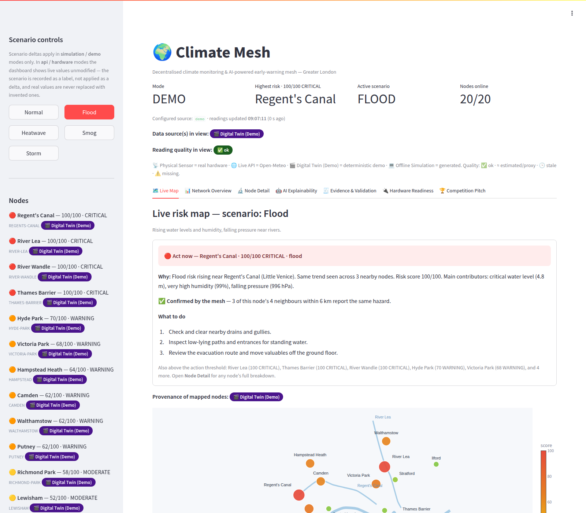 | 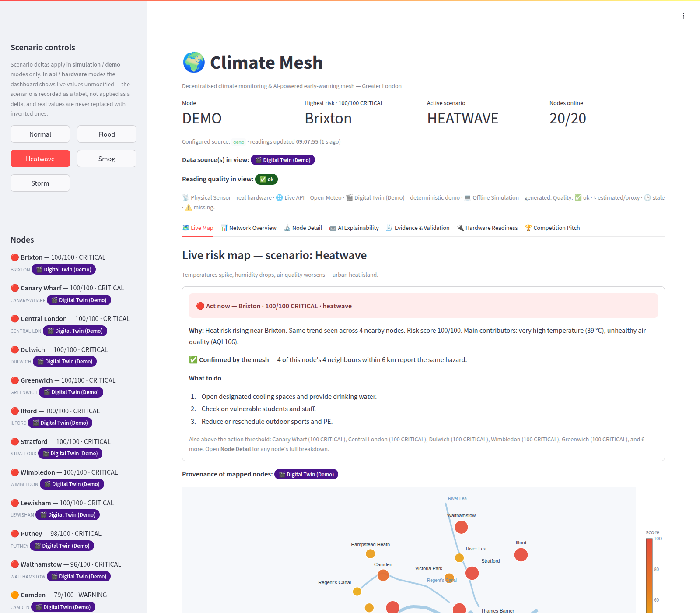 |
| **Network Overview** — fleet risk, highest node, active alerts, risk-by-node and distribution charts | **Node Detail** — Regent's Canal: readings, provenance badges, the plain-English *Why:* line and the six sub-scores |
| 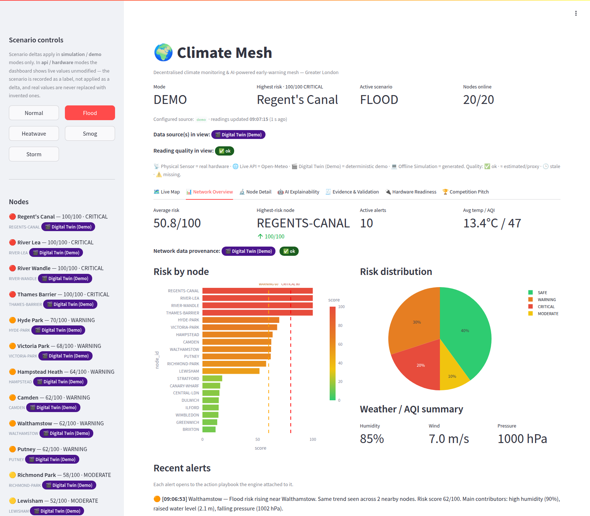 | 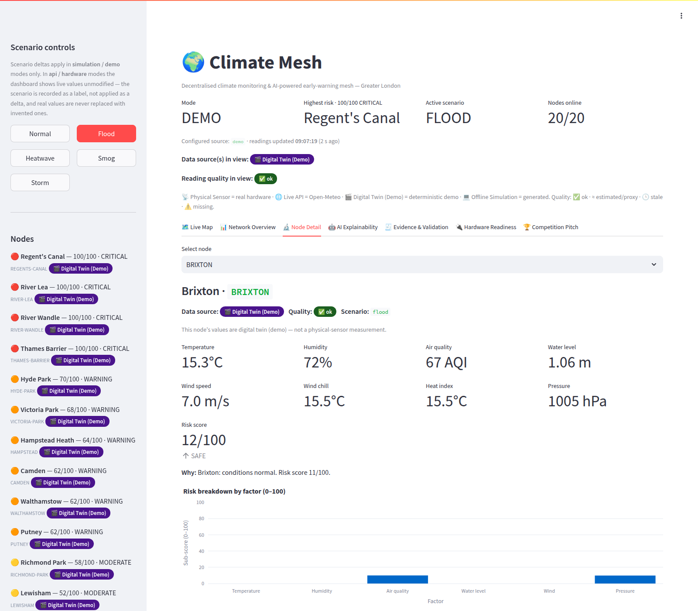 |
| **AI Explainability** — which nodes the Isolation Forest flagged and why | **Hardware Readiness** — honest "no physical sensor detected" state |
| 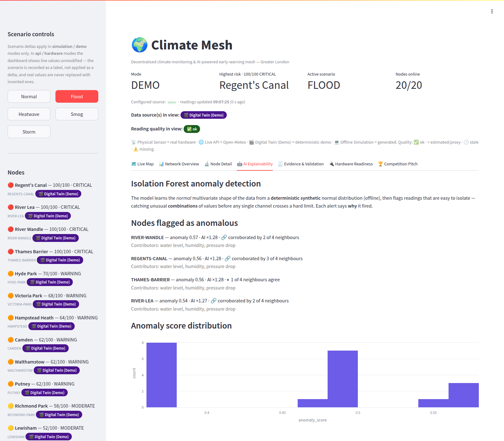 | 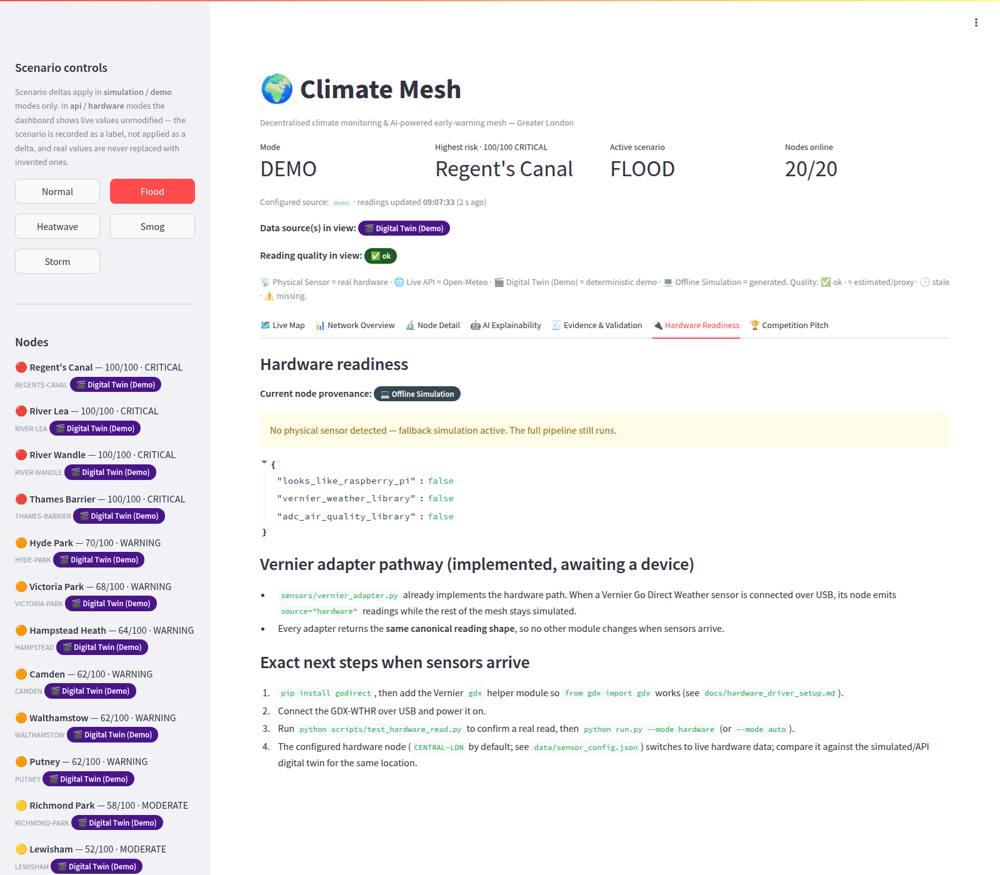 |
| **Evidence & Validation** — run metadata, row counts, export commands | **Competition Pitch** |
| 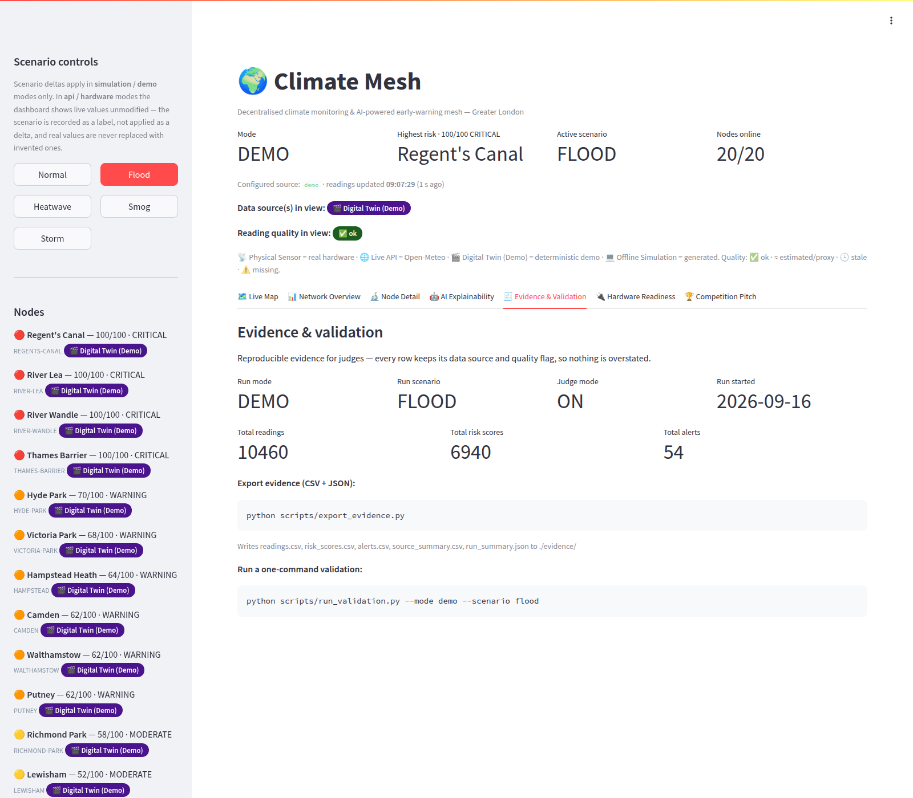 | 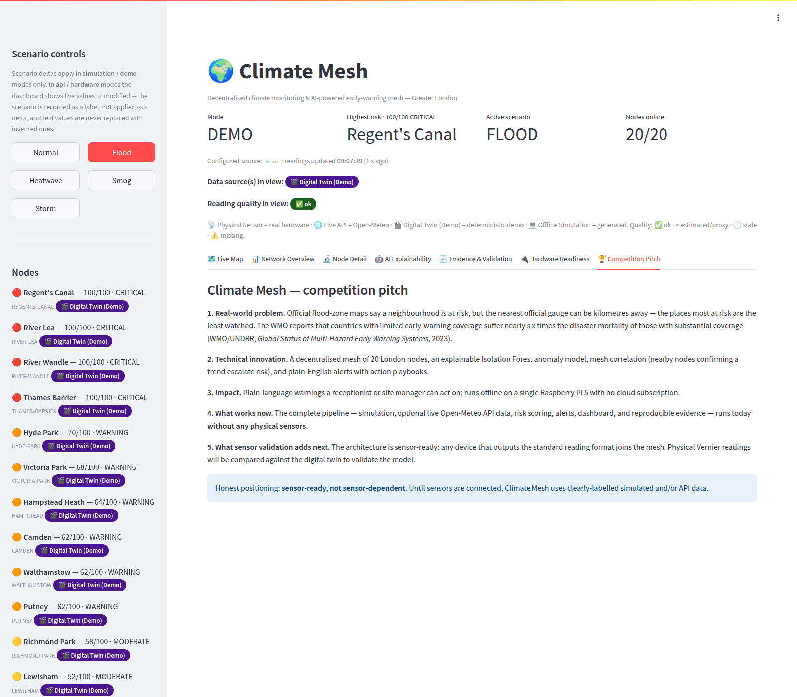 |
| **Network Overview after clicking *Heatwave* in the sidebar** — live scenario switching | **`python scripts/judge_validate.py`** — the one-command PASS table |
| 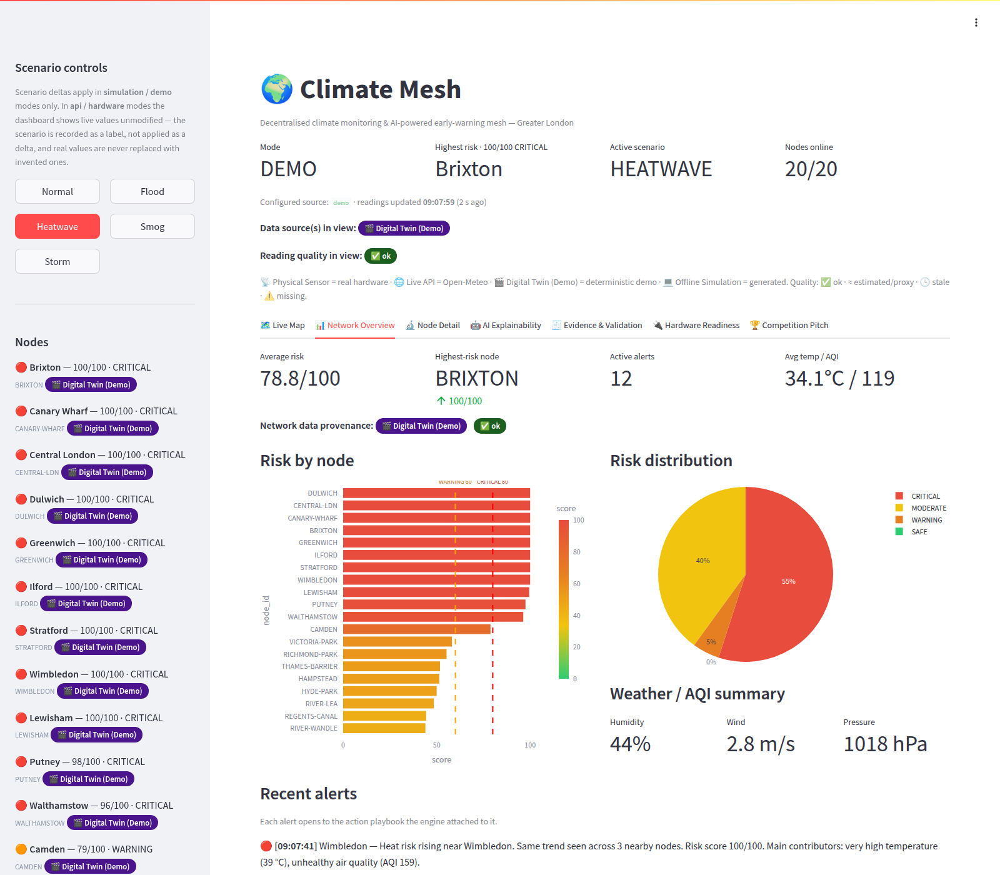 | 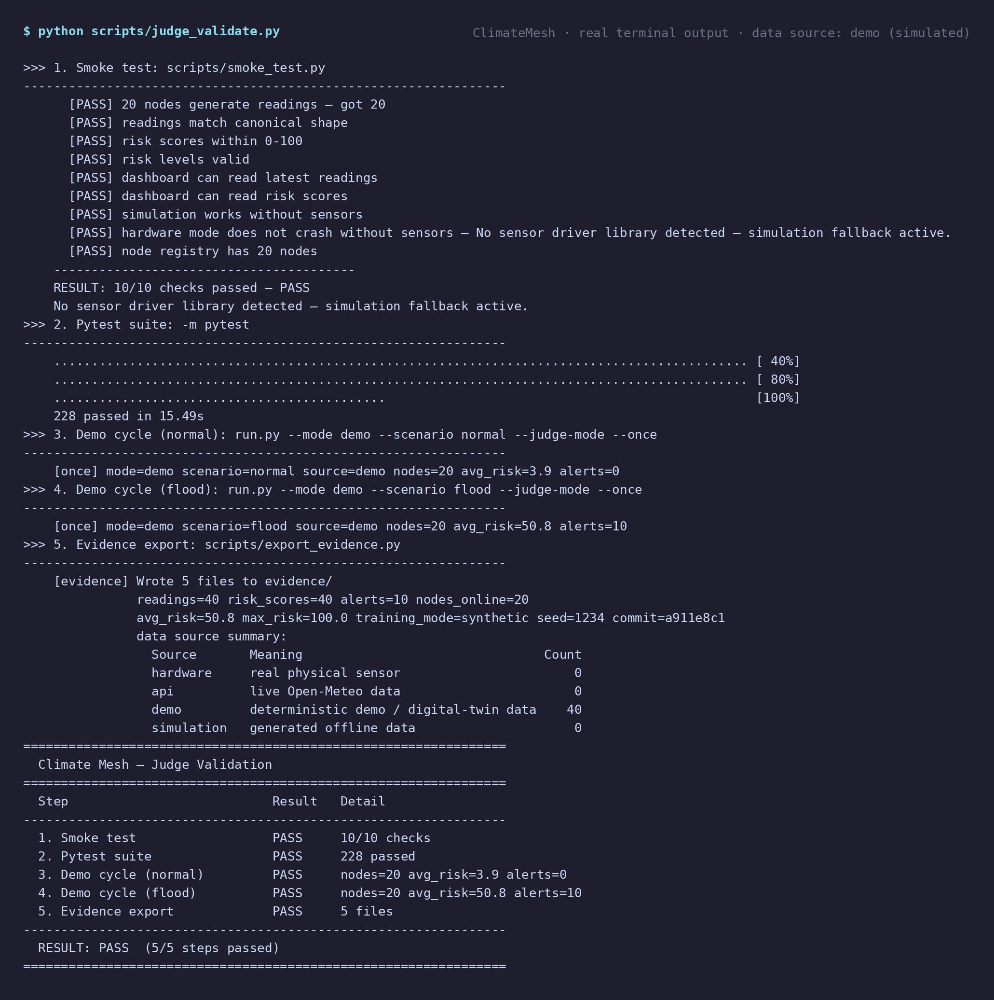 |

Terminal evidence for `demo_tour.py`, `pytest`, `smoke_test.py` and
`test_hardware_read.py` (FALLBACK SIMULATION, no sensor attached) is in the
same folder. With internet, untick **Offline basemap** and the same nodes sit
on a street map.

### What the screenshots show (and how to retake them)

The dashboard's 7 tabs are all screenshot-worthy — see
[docs/evidence_checklist.md](docs/evidence_checklist.md). In short:
**Live Map** (risk-coloured London nodes), **Network Overview** (KPIs + charts),
**Node Detail** (per-node readings, source/quality badges, risk breakdown), **AI
Explainability**, **Evidence & Validation**, **Hardware Readiness**, **Competition
Pitch**. Every panel carries a provenance badge — **📡 Physical Sensor**, **🌐 Live
API**, **🎬 Digital Twin (Demo)** or **💻 Offline Simulation** — plus a quality
badge (✅ ok · ≈ estimated · 🕒 stale · ⚠️ missing), so each shot self-labels its
data source. Two terminal screenshots round out the evidence:

- `python scripts/judge_validate.py` → the compact PASS/FAIL validation table.
- `python scripts/test_hardware_read.py` → **REAL HARDWARE** vs **FALLBACK
  SIMULATION** proof for the physical node path.

---

## Architecture

Every data source emits the **same canonical reading**, which flows through one
pipeline into SQLite (the message bus) and out to the dashboard, alerts, and
evidence export:

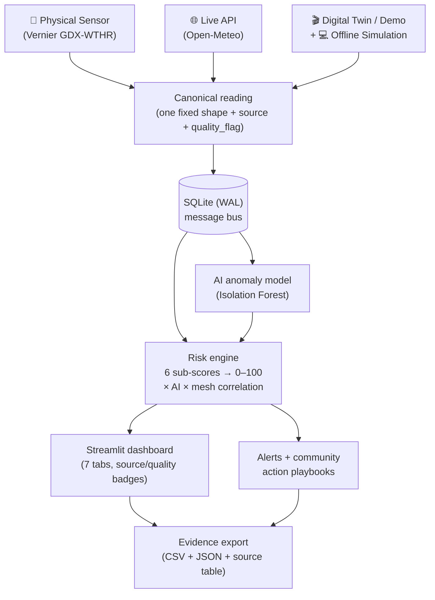

<details><summary>Text fallback (if Mermaid doesn't render)</summary>

```
Sensor / API / Digital-Twin → canonical reading → SQLite
   → AI anomaly model + risk engine → dashboard → alert/playbook → evidence export
```

</details>

## File structure

```
ClimateMesh/
  run.py                     # launcher: modes, scenarios, judge-mode, --once
  config/nodes.py            # 20 named London nodes + mesh neighbour map
  sensors/
    base.py                  # canonical reading shape + adapter base class
    simulated_adapter.py     # offline / demo data
    api_adapter.py           # live Open-Meteo data (falls back if offline)
    vernier_adapter.py       # physical Vernier sensor (falls back if absent)
    hardware_status.py       # sensor detection (never crashes)
  simulation/
    engine.py                # data generation: daily cycle, noise, scenarios
    scenarios.py             # flood / heatwave / smog / storm deltas
  ai/anomaly_model.py        # explainable Isolation Forest
  backend/
    risk_engine.py           # explainable scoring + mesh correlation + alerts
    playbooks.py             # community action playbooks per hazard
  data/database.py           # SQLite storage (readings, risk, alerts, runs)
  dashboard/app.py           # 7-tab Streamlit dashboard
  dashboard/badges.py        # provenance + quality badge wording (pure, unit-tested)
  data/sensor_config.json    # optional: which node the physical sensor represents
  scripts/
    judge_validate.py        # ONE command: smoke + pytest + demos + export + table
    demo_tour.py             # ONE command: all 5 scenarios, deterministic summary table
    test_hardware_read.py    # safe one-shot Vernier read: REAL HARDWARE vs FALLBACK
    reset_demo_db.py         # wipe DB to a clean state
    export_evidence.py       # CSV + JSON evidence export + source-count table
    run_validation.py        # one-command pass/fail validation
    smoke_test.py            # fast end-to-end check
    pi_benchmark.py          # measures cycle time + memory on this machine, prints a sentence
  tests/                     # pytest suite
  docs/                      # hardware driver setup, integration plan, evidence checklist, screenshots
  SUBMISSION_PACK/           # write-up (.md/.docx/.pdf), entry-form answers, figures, photos, build tooling
```

## Known limitations (honest by design)

We label exactly what this is and is not, so judges never have to guess:

- **The node layout is illustrative.** The 20 demo nodes sit at well-known
  Greater London public landmarks, chosen to exercise the environment types
  the layout uses (river, residential, urban, park) and the mesh-neighbour logic (`config/nodes.py`). They are not deployment
  sites, and no reading in this repository was measured at any of them.
- **One physical node, only when connected.** Hardware support is implemented and
  tested end to end with a stand-in device object that mimics Vernier's helper
  (`tests/test_hardware_stand_in_device.py`; see `sensors/vernier_adapter.py`,
  `docs/hardware_driver_setup.md`), but **not yet validated against a physical
  device**. A node emits `source="hardware"` **only** after a Vernier device
  actually opens and is read. With no device attached, that node falls back to
  clearly-labelled simulation (`quality_flag="missing"`). Verify with
  `python scripts/test_hardware_read.py`.
- **Hardware mode never measures air quality or water level.** The GDX-WTHR senses
  temperature, humidity, wind and pressure only — it does **not** sense air quality
  or water level. In `hardware` mode those two channels are conservative
  placeholders, so the whole reading is flagged `quality_flag="estimated"` (never
  `"ok"`): a `hardware`/`ok` label must never cover a non-measured channel.
- **API water level is a proxy, not a river gauge.** In `api`/historical modes the
  `water_level` channel is derived from precipitation, so it is flagged
  `quality_flag="estimated"` — it is an indicator, not a measured gauge reading.
- **Emergency scenarios are simulated for safe judging.** Flood / heatwave / smog /
  storm apply calibrated deltas **in simulation and demo modes only**
  (`simulation/engine.py`). In `api`/`hardware` modes the live values are shown
  **unmodified** — the scenario is recorded as a label (`scenario="observed"`),
  not applied as a delta. The scenarios are labelled demo / digital-twin, never
  real events, and never overwrite real values with invented ones silently.
- **The AI is anomaly *support*, not an official warning.** The Isolation Forest
  flags unusual combinations to escalate risk and explain *why*; it is a
  decision-support signal, not an accredited meteorological warning system.

## Safety & privacy

- **No personal data.** The system stores environmental measurements only —
  no names, accounts, cameras, microphones, or location tracking of people.
- **Local-first.** Everything runs on the local machine/Pi; nothing is
  uploaded anywhere. The only outbound calls are the *optional* `api` /
  `historical` modes fetching public Open-Meteo weather data (no API key, no
  account), and they fall back to offline simulation.
- **Not an official warning system.** Alerts are decision support for a
  community; they advise practical low-risk actions and always defer to
  official emergency guidance.
- **Safe demos.** Emergency scenarios are simulated and labelled as such —
  judging never depends on (or misrepresents) a real emergency.

## How the AI works

`ai/anomaly_model.py` trains an **Isolation Forest** with two honest, selectable
training paths (`run.py --ai-training ...`):

- **`synthetic` (default):** 2000 deterministic synthetic *normal* samples — no
  internet, used by CI, the smoke test, and `--once`. Fully reproducible.
- **`historical` / `auto`:** ~30 days of **real** hourly Open-Meteo *archive*
  (ERA5) weather + air quality for one representative central-London point
  (the CENTRAL-LDN node). The first fetch is
  cached to `ai/_archive_cache.json`, so repeat runs train offline. If the
  archive is unreachable it **falls back deterministically to synthetic** and
  records that as `training_mode = "synthetic_fallback"` — synthetic data is
  never silently presented as historical.

The active `training_mode` is recorded in the run metadata, shown on the
dashboard's **AI Explainability** tab, and printed when training. For each
reading the model returns an anomaly score (0–1), whether it is anomalous, and
the channels deviating most from the **fitted** baseline. Unlike fixed
thresholds, it flags an unusual **combination** of values *before* any single
channel crosses a hard limit. A confirmed anomaly multiplies a node's risk by up
to **1.5×** (measured range 1.25×–1.36×).

## How the risk score works

For each node the engine computes six 0–100 hazard sub-scores — temperature,
humidity, air quality, water level, wind, pressure — and combines them
(worst hazard + 20% of the rest) into a 0–100 **base score**. Temperature and
humidity are two-sided: a frosty morning is filed as a **cold** hazard with its
own playbook, never as a "heatwave". It then applies:

- **AI multiplier** (design ceiling 1.5×; measured range 1.25×–1.36× once the
  Isolation Forest confirms an anomaly, and exactly 1.0× otherwise), and
- **Mesh multiplier** (1.2×) when **2+ adjacent nodes** show the same trend — a
  single spike is trusted less than a correlated regional event.

| Score | Level | Meaning |
|------:|-------|---------|
| 0–30  | SAFE | Within normal baseline |
| 30–60 | MODERATE | One factor drifting; advisory |
| 60–80 | WARNING | Confirmed anomaly on a node / correlated moderate readings |
| 80–100 | CRITICAL | Correlated anomaly across adjacent nodes |

Example alert (from the deterministic flood demo):
> *Flood risk rising near Regent's Canal (Little Venice). Same trend seen across
> 3 nearby nodes. Risk score 100/100. Main contributors: critical water level
> (4.8 m), very high humidity (99%), falling pressure (996 hPa).*
> **Suggested actions:** check and clear nearby drains; inspect low-lying paths;
> review the evacuation route.

## How to export evidence

```bash
# After running a demo for a little while:
python scripts/export_evidence.py
# -> evidence/readings.csv, risk_scores.csv, alerts.csv, source_summary.csv, run_summary.json
```

Each row keeps its `source` and `quality_flag`, so simulated/API/hardware data is
never confused. See [docs/evidence_checklist.md](docs/evidence_checklist.md).

## Troubleshooting

- **Dashboard says "No data yet"** → start the engine in another terminal:
  `python run.py --mode demo --scenario flood --judge-mode`.
- **`api` mode shows a fallback note** → no internet; it automatically uses
  simulation. This is expected and clearly labelled.
- **Map doesn't render** → the bundled Streamlit/Plotly versions use free
  OpenStreetMap-based tiles (no API key). Ensure `pip install -r requirements.txt`
  completed. The street tiles are the one thing that needs internet: tick
  **Offline basemap** in the sidebar and the Live Map draws the 20 labelled
  nodes over the Thames, Lea, Wandle and Regent's Canal instead, fully offline.
- **`pytest: command not found`** → use `python -m pytest`.
- **Reset everything** → `python scripts/reset_demo_db.py`.

## Competition notes

Climate Mesh was built for the PA Raspberry Pi Competition 2026/27. Its
competition strengths: an **evidence mode** for reproducible judging,
**explainable alerts**, a **sensor-ready-without-sensors** pipeline, **community
action playbooks**, **mesh correlation**, a **local digital twin**, and
**offline-first** operation.

## Tests

```bash
python scripts/judge_validate.py     # one command: smoke + pytest + demos + export
python scripts/demo_tour.py          # one command: all 5 scenarios, deterministic
pytest                               # the full unit-test suite (228 tests)
python scripts/smoke_test.py
python scripts/run_validation.py --mode demo --scenario flood
python scripts/test_hardware_read.py # REAL HARDWARE vs FALLBACK SIMULATION
python scripts/pi_benchmark.py       # cycle time, training time, peak memory on this machine
```

## Roadmap

In priority order — each item is *not done yet* until it is moved into the
sections above with evidence:

1. **Validate one physical node.** Read a real Vernier GDX-WTHR through the
   existing adapter and compare it against the digital twin for the same
   location (`scripts/test_hardware_read.py` is the entry point).
2. **Calibrate against history.** Use the evidence export to compare risk
   scores with recorded local flood/heat events, and tune thresholds from
   data instead of by hand.
3. **Physical mesh links.** Two or more real Pi nodes exchanging readings
   (Wi-Fi first, LoRa later) so mesh correlation runs across actual devices.
4. **Node cost pack.** A priced, tested bill of materials for a minimal
   community node — published only once a real node has run on it.

## Credits

Built by **Luis Yu and Leo Zhang**, two sixth-form students.

## Licence

MIT. Copyright (c) 2026 Luis Yu and Leo Zhang. See [LICENSE](LICENSE):
anyone may run, study, copy and adapt it, with attribution.
