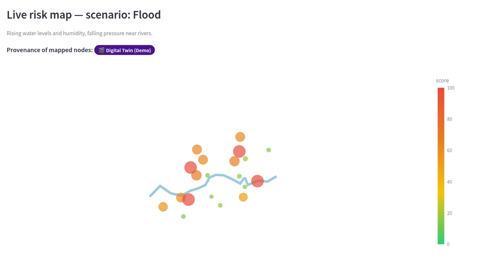
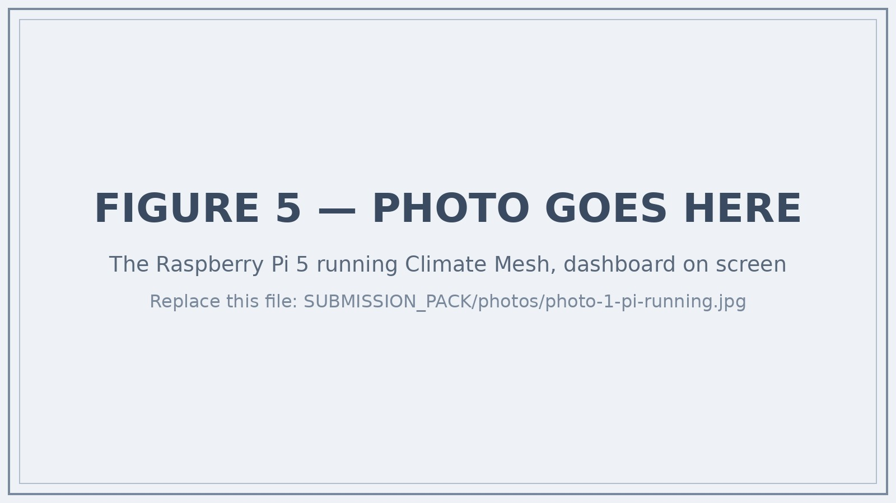
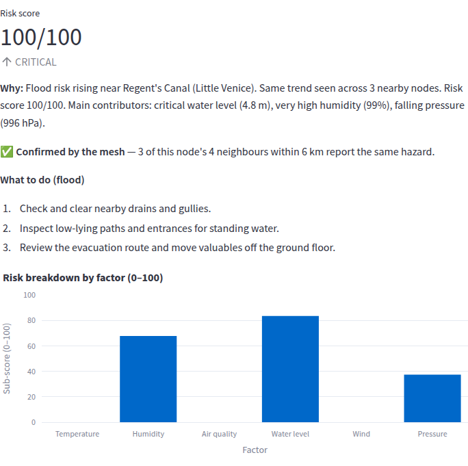
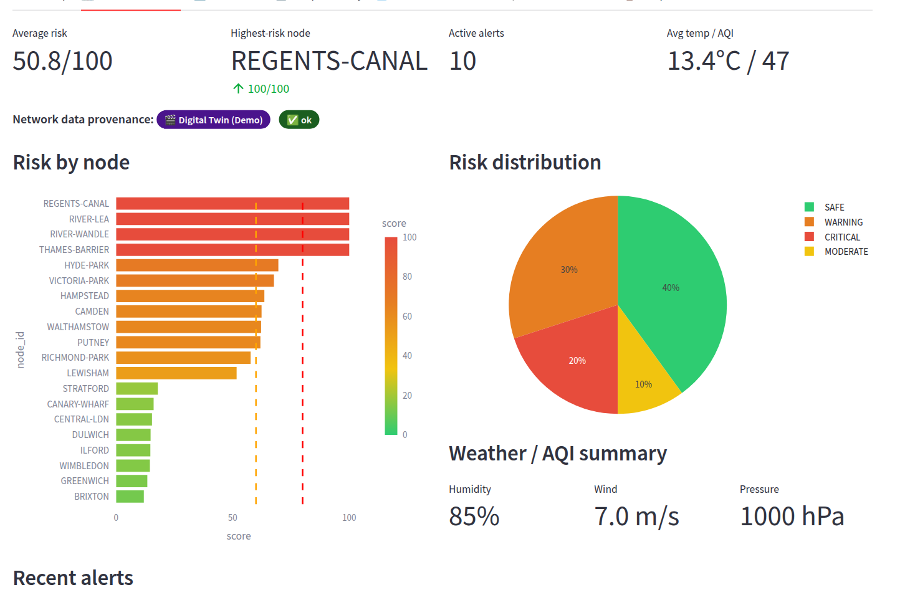
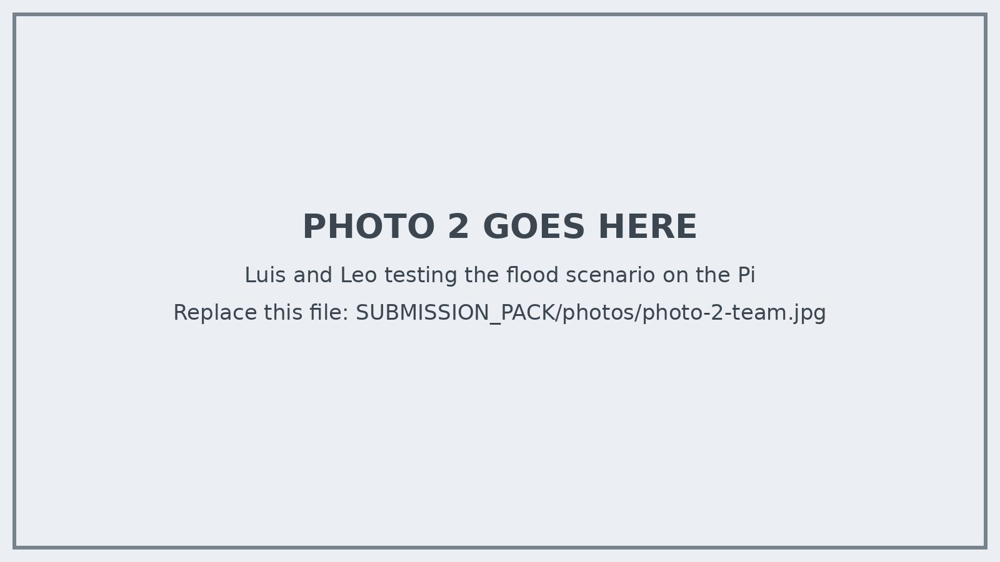

```{=openxml}
<w:p><w:r><w:br w:type="page"/></w:r></w:p>
```

## 1. The problem

The official river gauge nearest to a school or an estate can be kilometres
away from the stream, drain or underpass that actually floods. By the time an
official warning reaches a community, the water is already rising. The World
Meteorological Organization reports that countries with limited early-warning
coverage suffer nearly six times the disaster mortality of countries with
substantial coverage (4.05 versus 0.71 deaths per 100,000 people; WMO/UNDRR,
*Global Status of Multi-Hazard Early Warning Systems*, 2023). There is a gap
between where climate events happen and where they are measured.

> ► **One or two sentences in your own words: the real reason you picked
> this.** The underpass that floods on the way to school, the exam week in a
> heatwave, a relative in a flat with no cooling, or simply the moment you
> noticed the nearest official gauge was miles away. Do not invent one; if
> there is no such moment, say what made you curious or angry when you read
> about early warnings.

We wanted a low-cost way for a school or a community to watch its own streets,
and to be told in plain English what to do.

## 2. What we built

Climate Mesh is a network of 20 environmental "nodes" across Greater London,
simulated or fed by live weather data, that runs on a single Raspberry Pi 5,
fully offline, with no cloud account and no API key. Every two seconds each node reports eight channels: temperature,
humidity, air quality, water level, wind speed, wind chill, heat index and
barometric pressure. A risk engine scores every location from 0 to 100, an
explainable AI model flags unusual combinations of readings, neighbouring
nodes have to agree before a risk is escalated, and plain-English alerts with
community action playbooks appear on a seven-tab dashboard.

{.photo}

## 3. How it works

**One reading shape for every source.** Whether a value comes from a physical
sensor, the live Open-Meteo weather service or our simulator, it is turned into
the same canonical reading: the eight channels plus a `source` label
(`hardware` / `api` / `demo` / `simulation`) and a `quality_flag` (`ok` /
`estimated` / `stale` / `missing`). Everything downstream (the risk engine,
the AI, the database, the dashboard and the evidence export) only ever sees
that shape. A real sensor joins the mesh by adding one adapter; nothing else
changes.

{.wide}

**An explainable risk score.** For each node the engine computes six hazard
sub-scores on a 0–100 scale (temperature, humidity, air quality, water level,
wind, pressure); wind chill and heat index are derived comfort values
(NOAA/Steadman) shown to the user, not scored twice. The sub-scores are
combined as *worst hazard plus 20 % of the rest*, so one severe hazard alone
can reach CRITICAL while several moderate ones also escalate. The bands are
SAFE (under 30), MODERATE (30–60), WARNING (60–80) and CRITICAL (80–100).
Temperature and humidity are two-sided: a frosty morning is filed as a *cold*
hazard with its own advice, never as a "heatwave".

**AI that explains itself.** An Isolation Forest learns the normal shape of
the data and flags readings that are easy to isolate (a bit like spotting the
odd one out in a crowd: a reading that can be separated from all the others in
a few cuts is unusual), so an unusual *combination* of values is caught while
each channel is still only moderately elevated. A confirmed anomaly multiplies
the node's graded risk by up to 1.5×, and the model reports which channels
deviate most from the learned baseline, so every alert says *why*.
Deliberately, the AI can amplify risk but never create it: 1.5× a SAFE score
of 5 is still SAFE, so even the roughly 5 % of ordinary readings an Isolation
Forest is expected to mis-flag cannot turn a SAFE node into an alert. Offline
it trains on 2,000 deterministic synthetic samples; when online it can instead
train on about 30 days of real hourly ERA5 weather and air quality for a
representative central-London point from the Open-Meteo archive (cached after
the first fetch), and it records which path it used. Every number in this
write-up was produced with the synthetic path; training on the archive is a
one-flag change (`--ai-training historical`).

**Neighbours have to agree.** Two nodes within 6 km are neighbours. The 1.2×
mesh multiplier fires only when a node *and* at least two of its neighbours
are elevated for the *same* hazard. A single glitching sensor cannot cry wolf;
a correlated regional event is escalated. A worked example from the flood
frame: Hyde Park's own sub-scores give a base of 58.0 (MODERATE). Four of its
neighbours are elevated for the same flood hazard, so the mesh multiplier
applies: 58.0 × 1.2 = 69.6, WARNING, and an alert is raised. Regent's Canal,
by contrast, saturates on its own: water 83.5 + 20 % of (humidity 67.8 +
pressure 37.3) = 104.5, capped at 100, before any multiplier. In the heatwave frame Lewisham
shows both layers at once: base 65.8 (WARNING) × AI 1.26 × mesh 1.2 = 99.5,
CRITICAL.

**Alerts people can act on.** WARNING and CRITICAL results raise an alert
containing the plain-English explanation and a playbook of practical, low-risk
actions for that hazard (flood, heatwave, smog, storm, cold). Alerts are
rate-limited so the log never fills with duplicates.



**How the parts talk.** The engine writes every reading and score into one
small database file on the Pi; the dashboard only ever reads that file, so it
can never alter the data, and either half can be restarted without losing
anything. The sensor loop reads all 20 nodes every 2 seconds (every 60 seconds
in `api` mode, to respect Open-Meteo's free service) and the risk engine
scores them every 3 seconds. A one-command export writes every reading, score
and alert to CSV and JSON, each row still carrying its source and quality
flag, plus a table of how many readings came from each source.

## 4. What we think is new

Not any single part, but the combination:

- **Neighbours as a trust signal.** A cheap node's risk is escalated only when
  it and at least two neighbours within 6 km are elevated for the same hazard,
  so a network of £85 nodes is harder to fool than one expensive sensor.
- **A bounded, explainable AI layer.** The Isolation Forest names the channels
  responsible and can only amplify graded risk (up to 1.5×), never create it.
- **Provenance enforced in code, not by convention.** Every reading, panel,
  alert and exported row carries its source and quality flag; `is_simulated`
  is derived from `source` so the two can never disagree; a reading with an
  unknown source or flag is rejected at construction; a missing or non-numeric
  channel scores 0 rather than falling through to CRITICAL; each score is
  rounded once so the stored number, its band and the alert text always agree;
  and the dashboard can only show a "Physical Sensor" badge when a reading
  really came from a device.
- **Reproducible by a stranger.** The whole pipeline, model included, runs
  offline on one Pi 5, and one command reruns our entire evidence chain.

## 5. What is real and what is simulated

We label exactly what this is and is not.

::: {.tbl-modes}
| Mode | Data | Internet | Sensors |
|-------|---------------------|----------|------------|
| `simulation` | Realistic generated data (default) | No | No |
| `demo` | Deterministic, screenshot-stable data | No | No |
| `api` | Live Open-Meteo weather and air quality for all 20 locations | Yes, falls back to simulation | No |
| `hardware` | One physical Vernier weather sensor, simulated mesh for the rest | No | Yes, falls back if absent |
| `auto` | Hardware, else API, else simulation | Optional | Optional |
:::


- The 20 nodes sit at well-known London landmarks chosen to exercise the
  environment types (river, residential, urban, park). They are illustrative,
  not deployment sites.
- The hardware path (a Vernier Go Direct Weather sensor, GDX-WTHR, over USB)
  is implemented and tested end to end with a stand-in device object that
  mimics Vernier's helper library (it opens, answers, answers badly or refuses
  to open, and the adapter is checked for each), but it has **not yet been
  validated against a physical device**. A node is labelled `hardware` only
  after a device actually opens and returns a reading.
- The GDX-WTHR senses temperature, humidity, wind and pressure only. In
  `hardware` mode the air-quality and water-level channels are conservative
  placeholders, so a hardware reading is always flagged `estimated`, never
  `ok`: a `hardware/ok` label can never cover a channel that was not measured.
- In `api` mode the water level is derived from precipitation, not read from a
  river gauge, so it is flagged `estimated`; it is an indicator, not a
  measurement.
- The flood, heatwave, smog and storm scenarios are simulated so that judging
  never depends on a real emergency. In `api` and `hardware` modes live values
  are shown unmodified.
- The AI is decision support for a community, not an accredited warning
  system. Alerts always defer to official guidance.

## 6. Evidence that it works

- **180 automated tests pass** on Python 3.11, 3.12 and 3.13, including a test
  that executes all seven dashboard tabs in Streamlit's headless test harness
  and tests that pin the exact numbers quoted below. Continuous integration
  runs the suite on every push on x86-64 (Python 3.11 and 3.13) and on a
  64-bit Arm Linux runner (Python 3.11), the Pi's architecture.
- `python scripts/judge_validate.py` runs the smoke test, all 180 tests, a
  normal and a flood demo cycle and the evidence export → **PASS (5/5 steps
  passed)**. Its full output is `docs/screenshots/terminal-judge_validate.png`
  in the repository.
- `python scripts/demo_tour.py` runs one deterministic cycle of all five
  scenarios in about thirty seconds. Repeated runs print identical numbers;
  its full output is reproduced in the Appendix.

::: {.keep .tbl-tour}
The demo tour, one row per scenario:

| Scenario | Average risk | Worst node | Level | Alerts |
|---|---:|---|---|---:|
| normal | 3.9 | Greenwich | SAFE | 0 |
| flood | 50.8 | Regent's Canal (Little Venice) | CRITICAL | 10 |
| heatwave | 78.8 | Brixton | CRITICAL | 12 |
| smog | 82.7 | Brixton | CRITICAL | 15 |
| storm | 98.1 | Brixton | CRITICAL | 20 |
:::

::: {.keep .tbl-ablation}
What the AI and mesh layers add, on the same deterministic frames (number of
nodes in each band):

| Scenario | Sub-scores only | With AI and mesh | What changed |
|------|-----------|------------|---------------------|
| normal | 20 SAFE | 20 SAFE | Nothing: no node is flagged anomalous, no false alarm. |
| flood | 4 CRITICAL, 8 MODERATE, 8 SAFE | 4 CRITICAL, 6 WARNING, 2 MODERATE, 8 SAFE | Neighbour agreement lifts six residential and park nodes to WARNING; alerts 4 → 10. |
| heatwave | 8 CRITICAL, 4 WARNING, 8 MODERATE | 11 CRITICAL, 1 WARNING, 8 MODERATE | The AI flags 11 urban nodes as anomalous; three move from WARNING to CRITICAL. |
| smog | 12 CRITICAL, 8 MODERATE | 12 CRITICAL, 3 WARNING, 5 MODERATE | Neighbour agreement lifts three river and park nodes; alerts 12 → 15. |
| storm | 5 CRITICAL, 15 WARNING | 19 CRITICAL, 1 WARNING | 18 AI anomalies plus agreement across 19 nodes. |
:::

The layers only ever amplify a hazard the sub-scores already see; they cannot
invent one. These counts are pinned by a test, like the other numbers in this section.



## 7. The Raspberry Pi 5

The Pi 5 is the whole product: it runs the simulator or the live data source,
the scikit-learn model, the risk engine, the database and the web dashboard at
the same time, headless, at the site.

::: {.keep .tbl-bom}
**Bill of materials for one node (approximate UK prices, September 2026):**

| Item | Purpose | Approx. cost |
|--------------------|---------------------|---------:|
| Raspberry Pi 5 (4 GB) | Runs everything | £55 |
| 27 W USB-C power supply | Power | £12 |
| 32 GB microSD card | OS and software | £8 |
| Case with fan | Protection | £10 |
| **Core node total** | | **£85** |
| Vernier Go Direct Weather (GDX-WTHR), optional | Physical temperature, humidity, wind and pressure | ~£130 |
:::

A community node therefore costs less than a hundred pounds before sensors;
the software costs nothing and needs no subscription.

**Speed.** We kept the per-cycle cost small on purpose: the 20 nodes are
scored by the Isolation Forest in one batch rather than one at a time, which
cut a full cycle from about 425 ms to about 23 ms on our development machine
(a 16 GB x86-64 Linux laptop, Python 3.11), where the model trains in 0.2 s
and the engine peaks at about 200 MB of memory.

**On Arm.** The same suite and benchmark run in our continuous integration on
a real 64-bit Arm Linux machine (GitHub's Arm runner: four Neoverse-N2 cores,
16 GB, Python 3.11 as Raspberry Pi OS ships). Every dependency installed from
a prebuilt Arm wheel with compilation forbidden, all 180 tests passed in 9 s,
the model trained in 0.1 s, a full 20-node cycle took 13 ms and the engine
peaked at 199 MB.

**On the Pi.** We have not yet timed it on the Pi 5 itself, so we give a
bound rather than a number: its Cortex-A76 cores are slower than those server
cores, but even if the Pi were eight times slower (two to three times is more
likely) a cycle would take about 100 ms, 5 % of the 2-second read interval,
and the 200 MB footprint sits comfortably inside the 4 GB board with the
dashboard alongside. `python scripts/pi_benchmark.py` prints the measured
sentence for whatever machine it runs on.

**Installation.** Every dependency ships a prebuilt 64-bit Arm wheel (the Arm
job in our CI installs with compilation forbidden, to prove it), so
installation on Raspberry Pi OS is one script (`setup_pi.sh`): it creates a
Python environment, installs the requirements (no compiler or special tools
needed) and runs the smoke test. The dashboard is only reachable from the Pi
itself, or from a laptop connected to it securely over SSH, so nothing is
opened up on the school network. The map has an offline basemap option, so
even the Live Map works with no internet.

## 8. Impact

**What it looks like on the day.** It is a wet November morning. The
water-level channel at the Regent's Canal node climbs. Three neighbouring
nodes report the same trend, so this is not one stuck sensor, and the site
manager's screen reads: *"Flood risk rising near Regent's Canal (Little Venice). Same
trend seen across 3 nearby nodes. Risk score 100/100. Main contributors:
critical water level (4.8 m), very high humidity (99%), falling pressure
(996 hPa)."* Under it are three things to do now: check and clear the nearby
drains and gullies, inspect low-lying paths and entrances for standing water,
and move valuables off the ground floor. The official area warning may follow
later; the point is that someone on site had a reason to act before it did.
(The quoted alert is the actual output of `python scripts/demo_tour.py` for
the flood scenario, on simulated data.)

Climate Mesh is aimed at the people who actually respond first: a school site
manager, a receptionist, a residents' association. For the streets that
official gauges do not cover, it gives them a risk score they can read at a
glance, the reason it is rising, and three practical things to do. It stores
only environmental measurements, never personal data, and runs entirely
locally, so a school can adopt it without a data-protection review or a cloud
bill. Because every node is cheap and every reading carries its provenance, a
network of schools could pool their nodes into a genuine neighbourhood
early-warning mesh.

## 9. Teamwork and what we learned

We are a team of two, Luis Yu and Leo Zhang. The first version of Climate
Mesh went into our repository in early August 2026; by the end of that month
it carried 144 automated tests, and the final review before submission
brought that to 180. We worked on it together throughout, reviewing each
other's changes, and we would both be able to explain any part of it to a
judge.

The first thing that worked was the simulator: twenty nodes with a daily
cycle and some noise, and a risk score that went red when we typed in a
flood. That took an afternoon and felt like most of the project. It was not.
Almost everything after it was about trust: deciding what the system is
allowed to claim. We argued about whether the demo could show a "sensor"
reading for a sensor we did not have, and decided it could not. That decision
is now enforced in code: a node can only be labelled `hardware` after a real
device opens, and a badge saying "Physical Sensor" can only appear when a
reading actually came from one. It cost us the easy screenshot and gave us the
project's spine.

The worst week was the one where we made the demo deterministic. Every
screenshot and every number in this document had to be reproducible by a
stranger, which meant fixed seeds, a frozen clock in judge mode, and tests
that pin the published figures. We broke the numbers several times while
"improving" the risk engine, and each time a test told us before a judge
could. We also learned to test the dashboard itself, not just the maths: an
automated run of all seven tabs found that one tab crashed whenever real data
was present, which we had never noticed because we always looked at the first
few tabs.

If we were starting again, or advising a Year 10 team: build the honest
version first, make one command that proves it works, and only then make it
look good.

**What was hardest.** The three things above: deciding what the system is
allowed to claim (a reading is "hardware" only after a device physically
opens; a water level derived from rainfall is flagged `estimated`; the AI
records whether it trained on real or synthetic data), making every published
number reproducible by a stranger, and testing the dashboard itself rather
than just the maths. The crash the tab test caught was a whole column of
data-source labels being tested as if it were a single yes/no value, which
broke the Hardware Readiness tab whenever live data was present and blanked
the Competition Pitch tab after it.

**What we learned.** The big one: an honest system is more work than an
impressive one, and the work is mostly saying no to yourself. Technically:
that anomaly detection finds odd *combinations* that thresholds miss; that a
test which pins a number you have published is the best guard against quietly
breaking your own claims; and that a whole machine-learning pipeline really
does fit on a £55 computer.

{.photo}

## 10. What we would do next

1. **Validate one physical node.** Read a real Vernier GDX-WTHR through the
   existing adapter and compare it against the digital twin for the same
   location.
2. **Calibrate against history.** Use the evidence export to compare risk
   scores with recorded local flood and heat events, and tune thresholds from
   data instead of by hand.
3. **Physical mesh links.** Two or more real Pi nodes exchanging readings
   (Wi-Fi first, LoRa later) so neighbour agreement runs across actual devices.
4. **Node cost pack.** A priced, tested bill of materials for a minimal
   community node, published once we have built one from it and run it.

## 11. Safety, privacy and responsible use

No personal data is stored: no names, accounts, cameras, microphones or
tracking of people. The only optional outbound calls fetch public Open-Meteo
weather data. Emergency scenarios are simulated and labelled as such, so
judging never depends on or misrepresents a real emergency. Alerts are
decision support and always defer to official emergency guidance. The
hardware is low-voltage and USB-powered.

## 12. Acknowledgements and help received

Built in Python with Streamlit (dashboard), scikit-learn (Isolation Forest),
pandas, NumPy, Plotly and SQLite. Live and archive weather data come from
the free Open-Meteo service. The hardware path uses Vernier's `godirect`
driver and `gdx` helper. Early-warning statistics are from the World
Meteorological Organization and UNDRR. The heat index follows the
NOAA/Steadman formulation.

**Help received.** We declare this whether or not the entry form asks, because
the whole point of the project is saying where things come from. During the
final review of this entry we used an AI coding assistant (Anthropic's
Claude): it reviewed the code, fixed the bugs it found, added tests, captured
the screenshots and helped edit this document. No teacher, mentor or other
adult wrote any part of the code or of this document. The concept, the design
and the original codebase are our own work.

## Appendix — Running it yourself

```bash
python3 -m venv .venv && source .venv/bin/activate   # Windows: .venv\Scripts\activate
pip install -r requirements.txt
python scripts/judge_validate.py        # smoke test + 180 tests + 2 demo cycles + export
python scripts/demo_tour.py             # all five scenarios in ~30 s
python run.py --mode demo --scenario flood --judge-mode   # terminal 1
python -m streamlit run dashboard/app.py                  # terminal 2 → http://localhost:8501
```

The repository's `README.md` has the full file map, run modes and
troubleshooting; `docs/screenshots/` holds every dashboard tab and the terminal
evidence.

::: {.keep}
The demo tour's output, exactly as printed (the numbers quoted in §6):

```
==============================================================================
  Climate Mesh - Demo Tour (deterministic, synthetic data, no hardware)
==============================================================================
  Scenario     Avg   Max  Worst node             Level     Alerts
------------------------------------------------------------------------------
  normal       3.9  11.4  Greenwich              SAFE           0
  flood       50.8 100.0  Regent's Canal (Little Venice) CRITICAL      10
  heatwave    78.8 100.0  Brixton                CRITICAL      12
  smog        82.7 100.0  Brixton                CRITICAL      15
  storm       98.1 100.0  Brixton                CRITICAL      20
------------------------------------------------------------------------------
  Risk is 0-100. Every reading above is source=demo, is_simulated=True.
==============================================================================

  Sample explanation (flood, Regent's Canal (Little Venice)):
    Flood risk rising near Regent's Canal (Little Venice). Same trend seen across 3 nearby nodes. Risk score 100/100. Main contributors: critical water level (4.8 m), very high humidity (99%), falling pressure (996 hPa).

  RESULT: PASS (5/5 scenarios, deterministic, offline)
```

:::

